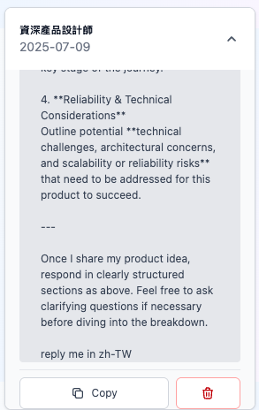
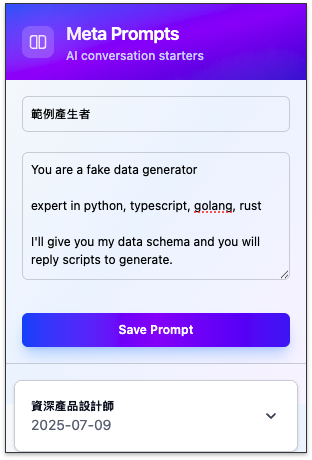

# Meta Prompt Marker

This browser extension helps you easily save, manage, and reuse your favorite meta-prompts across different AI chat platforms.

## Pre-requirements

To get started with development, you need to have [Bun](https://bun.sh/) installed on your system.

## Development

Follow these steps to set up the development environment:

1.  **Clone the repository:**
    ```bash
    git clone <repository-url>
    cd meta-prompt-marker
    ```

2.  **Install dependencies:**
    ```bash
    bun install
    ```

3.  **Build the extension:**
    The following command will compile the TypeScript files from the `src` directory into the `public` directory.
    ```bash
    bun run build
    ```

## How to Use

Once installed, the Meta Prompt Marker is straightforward to use:

1.  **Pin the Extension:** For easy access, pin the Meta Prompt Marker icon to your browser's toolbar.
2.  **Open the Popup:** Click on the extension icon in your toolbar to open the popup window.
3.  **Create a New Prompt:**
    *   In the popup, you'll find an interface to add new meta-prompts.
    *   Enter a descriptive **Title** for your prompt.
    *   Paste or type your meta-prompt content into the **Prompt Content** area.
    *   Click the "Save" button to store your new prompt.
4.  **Manage Prompts:**
    *   Your saved prompts will be listed in the popup.
    *   You can **edit** an existing prompt by clicking its title or an "Edit" icon.
    *   You can **delete** a prompt by clicking a "Delete" icon next to it.
5.  **Use Prompts in AI Chats:**
    *   When you are on an AI chat platform (e.g., ChatGPT, Bard, Claude), click the extension icon.
    *   Select the prompt you wish to use from your saved list.
    *   You can copy the prompt content to your clipboard and, depending on the platform, may also paste it directly into the chat input field.



